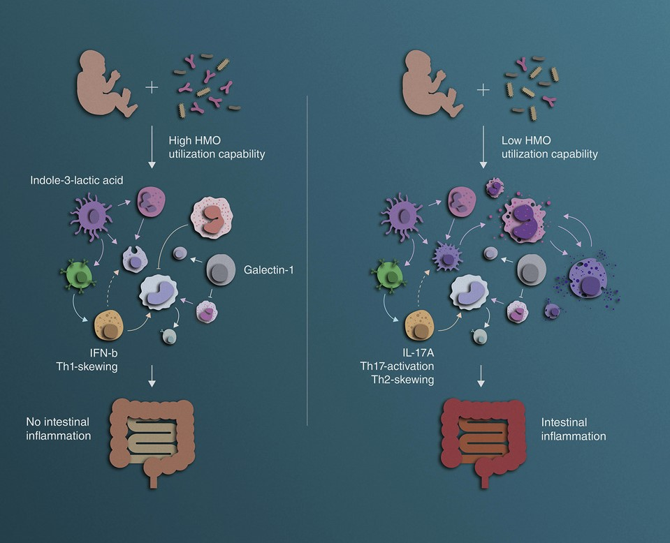
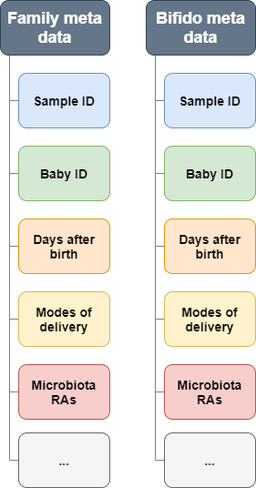

```{r setup, include=FALSE}
knitr::opts_chunk$set(echo = FALSE)
library(tidyverse)
library(knitr)
```

# Introduction

## Study {.build}

**Henrick et al. 2021:** Bifidobacteria-mediated immune system imprinting early in life

> - **Investigation:** The effects of bifidobacteria and HMO-utilization genes during the first months of life 
-  **Methods:** Longitudinal systems immunology analysis combined with metagenomic profiling

**Focus in this data analysis:**

-  Shotgun metagenomic sequencing of longitudinal fecal samples of infants

## Study design

```{r out.width='70%', fig.align='center'}

```

## Data

Two TSV files:

```{r include=FALSE}
bifido_meta <- read.table("../raw/bifido_meta.tsv", sep = '\t', header = TRUE)
family_meta <- read.table("../raw/family_meta.tsv", sep = '\t', header = TRUE)
family_bin <- read.table("../data/02_family_bin.tsv", sep = '\t', header = TRUE)
bifido_bin <- read.table("../data/02_bifido_bin.tsv", sep = '\t', header = TRUE)
family_vaginal_bin <- read.table("../data/02_family_vaginal_bin.tsv", sep = '\t', header = TRUE)
family_Csection_bin <- read.table("../data/02_family_Csection_bin.tsv", sep = '\t', header = TRUE)

bifido_vaginal_bin <- read.table("../data/02_bifido_vaginal_bin.tsv", sep = '\t', header = TRUE)
bifido_Csection_bin <- read.table("../data/02_bifido_Csection_bin.tsv", sep = '\t', header = TRUE)

bifido_heatmap <- read.table("../data/02_bifido_heatmap.tsv", sep = '\t', header = TRUE)
family_prep <- read.table("../data/03_family_prep.tsv", sep = '\t', header = TRUE)
bifido_prep <- read.table("../data/03_bifido_prep.tsv", sep = '\t', header = TRUE)
```

```{r out.width='30%', fig.align='center'}

```

# Methods

## Tidying data

> -   Bin data by weeks
>     - For subplots: filter by 'Vaginal' or 'C-section' prior to binning
> -   Drop NAs
> -   Filter data for weeks and bacterial species 
>     - Bifido heat map data: keep baby ID
> -   Remove data \>24 weeks
> -   Clean up names

## Raw data

Family meta data

```{r}
head(family_meta %>% 
  select(1:6),n=3)
head(family_meta %>% 
  select(7:10),n=3)
head(family_meta %>% 
  select(11:13),n=3)
```
## Raw data

Bifido meta data

```{r}
head(bifido_meta %>% 
  select(1:6),n=3)
head(bifido_meta %>% 
  select(7:10),n=3)
head(bifido_meta %>% 
  select(11:11),n=3)
```
## Tidying data

**Family data:**

```{r}
head(family_bin %>% select(1:4), n=5)

```

**Bifido data:**

```{r}
head(bifido_bin %>% select(1:4), n=5)

```


## Tidying data

**Family vaginal data:**

Filter for vaginal
```{r}
head(family_meta %>% filter(mode_delivery %in% c('Vaginal', 'Vaginal_instrumental')) %>% 
  select(1:7), n=3)

```
Bin by weeks and clean-up
```{r}
head(family_vaginal_bin %>% select(1:4), n=3)

```
Same steps were performed with filtering for C-section

## Tidying data

**Bifido C-section data:**

Filter for C-section
```{r}
head(bifido_meta %>% filter(mode_delivery %in% c('Planned_C-section', 'Acute_C-section')) %>% 
  select(1:7, -gestational_age), n=3)

```
Bin by weeks and clean-up
```{r}
head(bifido_Csection_bin %>% select(1:4), n=3)

```
Same steps were performed with filtering for Vaginal

## Tidying data
**Bifido heatmap data:**
Keeping baby ID when binning

```{r}
head(bifido_heatmap %>% select(1:4), n=10)

```

## Data analysis {.build}

Exploring the data:

> - Change in gutmicrobes across 24 weeks
- Family level abundance
- Bifidobacterium species level abundance 
- Bifidobacterium species level abundance by baby ID 

# Results
## Family level abundance
Calculating the relative abundance at family level. Families with mean ≤ 2% were merged into 'Other'

```{r, out.width='100%', fig.align='center'}
include_graphics("../results/04_family_fig.png", error = F)
```


## Family level abundance
Splitting the previous plot into Vaginal and C-section births

```{r, out.width='100%', fig.align='center'}
include_graphics("../results/04_family_sub_fig.png", error = F)
```


## Bifido sp. level abundance
Calculating the relative abundance at Bifidobacterium species level. Species with mean ≤ 2% were merged into 'Other'

```{r, out.width='100%', fig.align='center'}
include_graphics("../results/04_bifido_fig.png", error = F)
```


## Bifido sp. level abundance
Splitting the previous plot into Vaginal and C-section births

```{r, out.width='100%', fig.align='center'}
include_graphics("../results/04_bifido_sub_fig.png", error = F)
```


## Bifido species across infants

```{r, out.width='49%'}
include_graphics(c("../results/05_Heatmap_B_adolescentis.png", "../results/05_Heatmap_B_breve.png"), error = F)
```

## Bifido species across infants
```{r,out.width='26%'}
include_graphics(c('../results/05_Heatmap_B_animalis.png', '../results/05_Heatmap_B_angulatum.png',
'../results/05_Heatmap_B_bifidum.png','../results/05_Heatmap_B_catenulatum.png','../results/05_Heatmap_B_dentium.png', '../results/05_Heatmap_B_longum.png','../results/05_Heatmap_B_pseudocatenulatum.png','../results/05_Heatmap_B_pseudolongum.png',
'../results/05_Heatmap_B_psychraerophilum.png'), error = F)
```

# Discussion

## Discussion {.build}

> -  Increase in Bacteroidaceae and Bifidobacteriaceae at family level after birth in the majority of newborns. 
- This expansion most frequently involved _B. longum_, _B. breve_, and _B. bifidum_ in the first week.
- Variation at family and bifidobacterium level between modes of birth
- Highly variable bifidobacterial expansion across infants

**Impact?**

- Potential to alter the trajectory of immune system development? 
